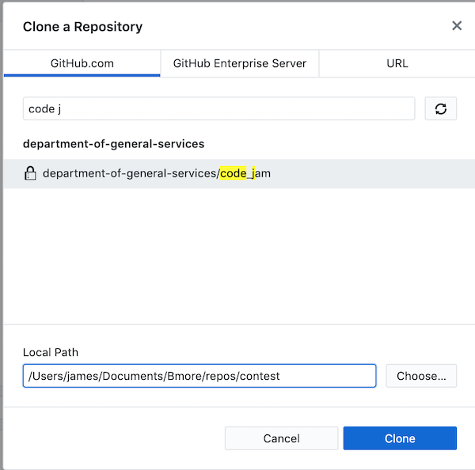

# Pushing to GitHub for Code Jam  
So, you've completed your function. Congratulations! The hard part is over. Now all you need to do is "push" your function to GitHub. This document exists to make that part as easy as possible. Let's break it down into steps. 

1. Save your function as a .py file  
You could copy the function and paste it into Visual Studio Code, then save it as a .py. Or, it's totally acceptable to go the File menu in Google Colab and select "Download .py". Save your submission as `code_jam_lastname.py`. So for me it'd be `code_jam_trimarco.py`.

2. Use GitHub Desktop to clone the code jam repo to your local
Make sure you've downloaded and authenticated GitHub Desktop (you'll have to provide it with your GitHub username and password). Then select "Clone repository" from the File menu. You'll see a search bar. Enter "code jam" in the search bar and you should see something like in the image below. Pick a good directory to clone into (the result will also be new directory called `code_jam`) and hit the blue button.

